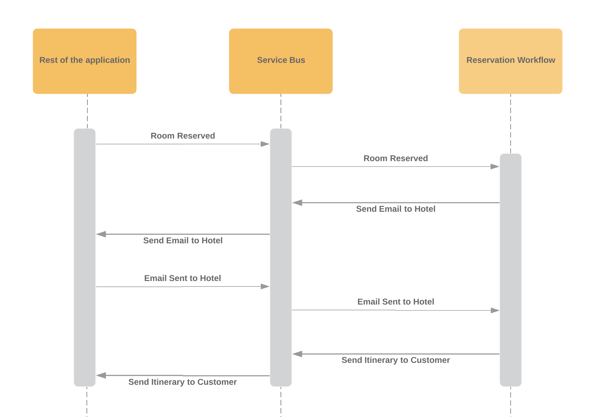

# @node-ts/bus

**A service bus for message-based, distributed node applications.**

[](https://snyk.io/test/github/node-ts/bus)
[](https://circleci.com/gh/node-ts/bus/tree/master)[](https://opensource.org/licenses/MIT)

View our docs at [https://node-ts.github.io/bus/](https://node-ts.github.io/bus/)

## Overview

- what problem does this solve?
  - application can be broken apart
  - application can be scaled out
  - does the heavy lifting to make sure nothing gets lost
- what's the difference to using an amqp library/rabbit/sqs etc
- new to messaging?
  - makes your app fault tolerant
  - your app can recover after an outage (ie if it's offline for a few hours, nothing is lost and will resume processing)
  - under load it's easy to stand up new instances of the app to help

## Installation

You can get the latest release and type definitions using npm:

```
$ npm install @node-ts/bus-core @node-ts/bus-messages --save
```

## Getting Started

This example assumes we're writing a hotel booking application. Guests can make a reservation with our app, which coordinates the reservation between the guest and the hotel.

### Step 1 - Let guests place a reservation

We want to write a new command and handler that allows guests to make a reservation. Once the reservation has been made, we want to publish an event to let the rest of the system know this has taken place. 

Firstly, the command and event definitions are created. These just hold data that is passed around across the message bus.

For a command, these represent all of the inputs and parameters that need to be know to execute (think of them as function parameters that will be passed to a service for execution).

For an event, the fields represent a historical fact of what changed as well as any other useful information that a consumer might want to know about.

```ts
// messages.ts
import { Command, Event } from '@node-ts/bus-messages'

export class MakeReservation extends Command {
  $name = 'hotel/make-reservation'
  $version = 1

  constructor (
    readonly customerId,
    readonly hotelId,
    readonly roomId,
    readonly fromDate,
    readonly toDate
  ) {
    super()
  }
}

export class ReservationMade extends Event {
  $name = 'hotel/reservation-made'
  $version = 1

  constructor (
    readonly reservationId,
    readonly customerId,
    readonly hotelId,
    readonly roomId,
    readonly fromDate,
    readonly toDate
  ) {
    super()
  }
}

```

Next we want to write a handler to receive and publish these messages:

```ts
// handle-make-reservation.ts
import { Bus, Handler } from '@node-ts/bus-core'
import { MakeReservation, ReservationMade } from './messages'
import { reservationService } from './reservation-service'

export const handleMakeReservation: Handler<MakeReservation> = async ({ message }) => {
  // `message` is of type `MakeReservation` and will be passed into this function each time a publisher send it
  const reservationId = await reservationService.makeReservation(message)

  // We publish that a reservation has been made so that any interested consumers can be notified
  const reservationMade = new ReservationMade(
    reservationId,
    message.customerId,
    message.hotelId,
    message.roomId,
    message.fromDate,
    message.toDate
  )
  console.log('reservation made', reservationMade)
  await Bus.publish(reservationMade)
}
```

Lastly we need to register the handler with the bus:

```ts
// application.ts
import { Bus } from '@node-ts/bus-core'
import { MakeReservation } from './messages'
import { handleMakeReservation } from './handle-make-reservation'

const run = async () => {
  await Bus
    .configure()
    .withHandler(MakeReservation, handleMakeReservation)
    .initialize()

  // Start the bus listening for messages
  await Bus.start()
}

run().catch(console.error)

```

At this point our app will be subscribed to a message queue and listening for its first command. We can send it out by doing:

```ts
const makeReservation = new MakeReservation(
  customerId,
  hotelId,
  roomId,
  fromDate,
  toDate
)
await Bus.send(makeReservation)
```

## Step 2 - Notify the hotel when a reservation is made


## Components

This library consists of the following main components:

### Message Handlers

Message handlers are simple, stateless functions that are invoked each time a message that your application subscribes to is received. They take the message as an argument, perform an action based on the message, and then complete. 

Messages can be sent using `await Bus.send()` for commands and `await Bus.publish()` for events (see [@node-ts/bus-messages](packages/bus-messages/) for more information about the two).

Here's a simple message-based program that will execute the `ReserveRoom` command. 

```typescript
import { Bus } from '@node-ts/bus-core'
import { ReserveRoom, ProgramCompleted } from './messages'
import { roomService } from './room-service'

const reserveRoomHandler = async ({ message }) => roomService.reserve(message)
const programCompletedHandler = async () => console.log('bye bye')

const run = async () => {
  await Bus
    .configure()
    .withHandler(ReserveRoom, reserveRoomHandler)
    .withHandler(ProgramCompleted, programCompletedHandler)
    .initialize()

  await Bus.send(new ReserveRoom())
  await Bus.send(new ProgramCompleted())
}
```


For more information on handlers, see [@node-ts/bus-core/handlers](packages/bus-core/src/handler/)

For more information on message types, see [@node-ts/bus-messages](packages/bus-messages/)

### Workflows

Workflows orchestrate the business process logic in your application. Business processes are specific to your application and problem domain and can be anything from carrying out the steps of an eCommerce site to process an order through to fulfilment, to managing a marketing campaign from start to finish.

Workflows are crucial in decoupling your application and keeping the ***how to do something*** separate from the ***when to do something***.

Consider the following business process that sends emails to the hotel, and then the customer when a hotel room is reserved:



Writing this process as a workflow is simple and resilient:

```typescript
import { Workflow, WorkflowData, completeWorkflow } from '@node-ts/bus-core'

const reservationWorkflow = Workflow
  .configure('reservation-workflow', ReservationWorkflowData)
  .startedBy(RoomReserved, ({ message }) => {
    // Notify the hotel that the room was reserved
    const notifyHotel = new SendEmailToHotel(
      roomReserved.roomId,
      roomReserved.fromDate,
      roomReserved.toDate
    )
    await this.bus.send(notifyHotel)

    // Add the room id to the workflow state
    return {
      customerId: roomReserved.customerId,
      roomId: roomReserved.roomId
    }
  })
  .when(
    EmailSentToHotel,
    {
      lookup: event => event.roomId,
      mapsTo: 'roomId'
    },
    async () => {
      // The current workflow state is injected into each handler
      const sendItineraryToCustomer = new SendItineraryToCustomer(
        data.customerId,
        data.roomId
      )
      await Bus.send(sendItineraryToCustomer)

      // Nothing left to do for this workflow, so mark it as complete
      return completeWorkflow()
    }
  )
```

This workflow coordinates a number of different systems without any knowledge of where they are or how they work. It does no work except to orchestrate individual actions (commands) to perform a larger process.

For more information, see [@node-ts/bus-core/workflow](/packages/bus-core/src/workflow/)

### Transports

Transports are message brokers that are use by this library for communication. RabbitMQ, AWS SQS, Kafka, MSMQ etc are all examples of message queueing technology that can be used. The choice of transport is largely irrelevant for the developer as this library abstracts away how these transports are configured and how retries/routing/discovery/concurrency all work. In fact switching between one messaging technology and another is largely transparent and should be possible without rewriting any of your code.

Currently transport adapters for RabbitMQ and AWS SQS have been written, but implementing a new persistence provider for a different technology is simple.

For more information, see [@node-ts/bus-core/transport](/packages/bus-core/src/transport/)

