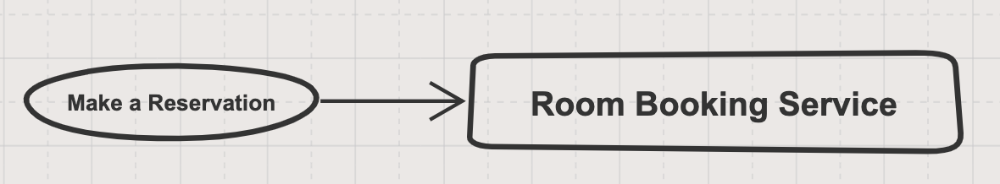
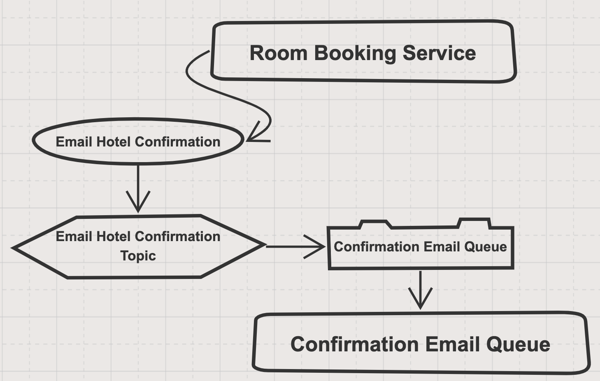
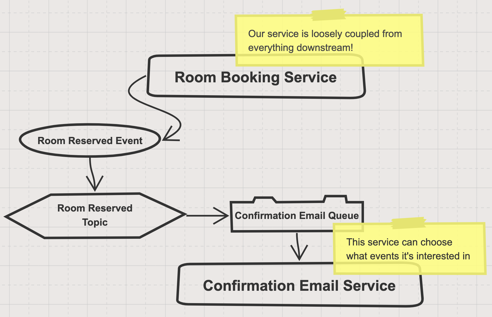

# Message Driven Microservices in Node

Integrating services and microservices using messages is a proven and scalable pattern in many languages. In Node however, it's more popular to integrate services using HTTP. This isn't surprising given the framework was grown out of a browser engine and powers many web-based projects.

There are a number of key advantages with message based integrations that are difficult and sometimes impossible to achieve with HTTP. We'll run through a basic evolution of a message driven microservice system in node.

## What Does a Message Based Integration Look Like?

Consider a fictional system that deals with hotel bookings. We might create a single service that's responsible for booking a hotel room and logically looks like this:



From a messaging perspective, we can communicate with the service by sending a `command` to make a reservation. This command is a message, which is just a JSON object describing what we want to do. This is placed into a message queue that the room booking service monitors. Whenever a message arrives, it is read and processed by the service. Our system will look like this:


The nice part about placing the reservations into a queue is that the room booking service can process it at its own pace. If we receive a spike of reservations or the service is offline; the messages will just queue up. All these messages will eventually be processed once the service is online. This is quite different to HTTP services where if the service is down then requests are discarded.

## Decoupling the System

The downside to the above model is that the sender of the command needs to know which queue to place it on. That means knowledge about what services exist in our system and effectively what their queue names are. This type of coupling really hurts when systems become more complicated, and can make it difficult to refactor.

To avoid this we can send the command to a `topic` instead. A topic is a routing mechanism that queues can subscribe to. We'd create a topic named after the command, and then subscribe the room booking queue to it. This way the sender can send commands to a topic of the same name, which will be automatically routed to the queue and service that handles that type of message. Our system now starts to look like this:


## Adding Another Microservice

At this point things are quite trivial - we have a system with a single microservice that processes bookings. The next thing we want to do is to send an email to the hotel each time a booking is made. We may decide that sending emails can be the responsibility of another service.

Given our current knowledge, we may jump straight in and build something where the room booking service sends a command to email the hotel with a confirmation like so:



This will work, but it couples together the process of booking a room with the process of sending an email confirmation to the hotel. This means that every time we book a room, a hotel email confirmation will be sent. It also means that the room booking service needs to know about and interact with the email confirmation system, and that we can no longer deal with it in isolation.

In order to decouple the room booking system from the email confirmation system, we need a way of reporting when a new reservation has been made that can be subscribed to by other services.

## Publishing Changes to Our System

If we want to broadcast that a command has been executed on our system, we use `events`.  These are a different type of message that just represent a historical fact that some change to our system has taken place. In our case, we want an event to be published that represents that a room booking was made.

Events are published to a topic that shares the same name of the event. Any services that are interested in a certain type of event can subscribe their service queue to that topic. In our case, we want to subscribe the confirmation email queue to the room reserved topic. This changes our system layout slightly:



This is great - we have two loosely coupled services. We can change our booking service, move it around, break it apart - it doesn't matter. As long as it produces a room reserved event that gets placed in the room reserved topic; the system will continue to work.

The problem now is with our email confirmation system. In order to send a confirmation, it must consume an event. What if we want to send the same confirmation in different circumstances? Perhaps we want to delay sending until the payment has cleared?

What we really want to do is completely decouple the two services, but *orchestrate* the logical flow of making a reservation and then sending a confirmation. 

## Exposing Process Logic Through Workflows

Workflows are a coordination/orchestration mechanism. They wait for events from one service, and then invoke the next step of their logical flow. 

Our workflow is simple and look something like this:


We can see that there is no direct connection between the room booking service and the email confirmation service. Nice! Instead, our workflow is subscribing to the room reserved events, and sending out a command to email the hotel with a confirmation each time.

Workflows are as simple or complex as your business processes, but they serve a very important function - they allow complete decoupling of all of your services. This makes your system far more flexible to work on and change.

## Show Me Some Code!

At this point you may be wondering how to achieve this in Node. Perhaps you're familiar with some queuing technologies like SQS or RabbitMQ but don't like the hassle of setting up queues, topics and managing subscriptions.

[@node-ts/bus](https://node-ts.github.io/bus/) is a Node library that does all of the heavy lifting of setting up message driven services, including creation of queues and topics, subscriptions, workflows, retries, routing etc.

The following is the message handling code for the make a reservation command:

```typescript
import { Command } from '@node-ts/bus-messages'
import { Bus } from '@node-ts/bus-core'
import { MakeAReservation, RoomReserved } from '@org/contracts'

@HandlesMessage(MakeAReservation)
export class MakeAReservationHandler {
  constructor (
    @inject(ROOM_SERVICE) private readonly roomService: RoomService,
    @inject(BUS_SYMBOLS.Bus) private readonly bus: Bus
  ) {
  }

  async handle (command: MakeAReservation): Promise<void> {
    // Pass the command to our internal service to make the reservation
    await this.roomService.reserve(command)

    // Publish an event that the room has been reserved
    await this.bus.publish(new RoomReserved(
      command.roomId,
      command.customerId,
      command.from,
      command.to
    ))
  }
}
```

When our service runs, any commands to make a reservation will find their way to this handle function. Under the hood [@node-ts/bus](https://node-ts.github.io/bus/) will:

* Create a topic for the `MakeAReservation` command
* Create a service queue for the room booking services
* Subscribe the service queue to the command topic
* Listen to the service queue, and dispatch any `MakeAReservation` commands to this handler function

If later you decide to move this handler to a different service, [@node-ts/bus](https://node-ts.github.io/bus/) will subscribe that service's queue to the command topic and the system will continue as normal.

## What Does the Workflow Code Look Like?

The workflow only operates on messages like commands and events. It's not allowed to query databases or anything else, as it should only model the flow of logic through your business. In our case the code is trivial:

```typescript
import { TestWorkflowData } from './test-workflow-data'
import { BUS_SYMBOLS, Bus } from '@node-ts/bus-core'
import { Workflow, StartedBy, Handles } from '@node-ts/bus-workflow'
import { RoomReserved, EmailHotelConfirmation } from '@org/contracts'

@injectable()
export class BookingWorkflow extends Workflow<{}> {

  constructor (
    @inject(BUS_SYMBOLS.Bus) private readonly bus: Bus
  ) {
    super()
  }

  @Handles<RoomReserved, {}, 'handleRoomReserved'>(RoomReserved)
  async handleRoomReserved (event: RoomReserved): Promise<Partial<{}>> {
    const command = new EmailHotelConfirmation(
      event.roomId,
      event.customerId,
      event.from,
      event.to
    )
    await this.bus.send(command)
    return this.complete()
  }
}
```

This workflow starts whenever a `RoomReserved` event is received, sends the `EmailHotelConfirmation` command and completes immediately. [@node-ts/bus](https://node-ts.github.io/bus/) will take care of creating and subscribing the underlying queue infrastructure so that the service hosting the workflow will receive all messages that the workflow susbcribes to.

In the real world, workflows can take minutes to months to complete depending on the business process. Data related to the current state of the workflow is retrieved and persisted on each message handling event. This allows the process to run for as long as is needed, across many services, and can resume processing like nothing happened even if the system goes offline.

## Conclusion

These are the fundamental building blocks of building a loosely coupled message driven microservice architecture in node. Even though these types of systems are more common in other languages, we hope that [@node-ts/bus](https://node-ts.github.io/bus/) can help node developers enjoy the same level of system resiliency, reliability and flexibility and not feel like HTTP integrations are the only option.
